# Streamlit

*written by candySad*

特别面向机器学习的python webapp框架，方便快捷的用python脚本搭建webapp


### 写在前面

Streamlit基于python脚本文件来实现网页应用，本质上，是在整个python脚本上不断重复从头运行到结尾的过程

这意味着，两个if...else分支中的部分是完全隔离，且通过按钮等方式运行一个又运行另一个时，其中一个的作用将完全不会对另一个分支产生任何影响，实际上Streamlit是从if...else语句的开头从新运行了这部分代码直到下一个暂停点

比如，点击第一个按钮使得if...else进入第一个分支修改一个全局变量tmp的值（初始为 0），使其自增 1，随后点击另一个按钮进入另一个分支，使tmp再次自增 1，最终tmp的值会是 1，因为两个分支最终只会运行一个，即第二个分支，第一个分支的操作会被Streamli回滚而取消

另外，所有可交互的组件如按钮和勾选框，对其进行一次交互只是修改了一次它的状态，与其绑定的on_click函数仅在其被激活的状态下运行一次，其没有激活时(按钮点击一次后，点击其他交互组件即会自动退回未激活状态)与其绑定的on_click函数就会回撤而变为未运行过的状态

因此，基于Streamlit的这种从前到后的脚本运行的特性，很多应用程序的编写逻辑可能与其他框架不同，当需要对某个数据反复修改时，需要考虑使用外部存储的方法

**这部分的一些详细例子将留在[最后](##使用说明)**


### 文档说明

本文档参照官方文档翻译总结

本文档的实例演示在同路径下

本项目结构

- `streamlit.md`：文档本身
- `example.py`：实例演示
- `mdimage`：文档图片
- `icon`：实例演示的webapp的icon
- `data`：实例演示中使用的媒体文件

缺失部分

- [图表显示组件](###图表)
- [Streamlit Components编写](####bi-directional component)
- [Streamlit Cloud](###Streamlit Cloud)
- [数据库连接](###数据库)


### 版本

本文档参照官方API文档版本**v1.2.0**编写


### 安装

```powershell
pip install streamlit
```


### 命令行指令

#### 启动streamlit的webapp服务

```powershell
streanlit run example.py
```


#### 命令行中的设置

```powershell
streamlit run your_script.py [-- script args]
```

例：

```
streamlit run your_script.py --server.port 80
```

使用`Ctrl`+`C`来停止应用程序


#### 查看文档

```
streamlit docs
```


#### 清除cache

```
streamlit cache clear
```


### import

```python
import streamlit as st
```

------


### 显示内容

#### st.write

```python
st.write(*args, **kwargs)
```

- 将传入的内容显示在页面中
  - 对换行效果没有很好的支持，换行符会被显示为一个空格

- **args** (any)
  - write(string) 
  - write(data_frame)： 将data_frame显示为表格
  - write(error) 
  - write(func) ：显示一个函数的相关信息
  - write(module)
  - write(dict) :
  - write(mpl_fig)
  - write(altair)
  - write(keras)
  - write(graphviz) 
  - write(plotly_fig)
  - write(bokeh_fig)
  - write(sympy_expr)
  - write(htmlable)
  - write(obj)
- unsafe_allow_html (bool)
  - 默认为False，会将参数中的html标签的内容渲染为纯文本
  - 设置为True则会渲染其中的html标签
  - 效果并不好，需要在页面中设置html代码部分应参照[Components API](####st.components.v1.html)


#### magic

把你要写的内容直接写在py脚本里，markdown或数据或图都行，streamlit会把它们渲染出来

将文本内容以多行注释的方式写出来

```python
# Draw a title and some text to the app:

'''
# This is the document title

This is some _markdown_.
'''

import pandas as pd
df = pd.DataFrame({'col1': [1,2,3]})
df  # 👈 Draw the dataframe

x = 10
'x', x  # 👈 Draw the string 'x' and then the value of x

# Also works with most supported chart types
import matplotlib.pyplot as plt
import numpy as np

arr = np.random.normal(1, 1, size=100)
fig, ax = plt.subplots()
ax.hist(arr, bins=20)

fig  # 👈 Draw a Matplotlib chart
```

- **当前magic功能仅能够在main文件中运行**
- magic功能默认开启，需要关闭则查看[相关设置](#####指令：查看所有设置)

------


### 文本元素

#### st.markdown

```python
st.markdown(body, unsafe_allow_html=False)
```

- Markdown
- **body**(str)
  - 按照[GFM](https://github.github.com/gfm)的标准渲染Markdown
  - 支持[github标准](https://raw.githubusercontent.com/omnidan/node-emoji/master/lib/emoji.json.)的emoji
  - 支持用\$或\$\$括起的$\LaTeX$公式，用[KaTeX](https://katex.org/docs/supported.html)渲染
- unsafe_allow_html (bool)


#### st.title

```python
st.title(body, anchor=None)
```

- 标题
- **body**(str)
  - 显示的内容
- **anchor**(str)
  - 设置该标题的锚点名称，不设置则为空
  - 锚点用于页面内跳转定位


#### st.header

```python
st.header(body, anchor=None)
```

- 头
- **body**(str)
  - 显示的内容
- **anchor**(str)
  - 设置该标题的锚点名称，不设置则为空
  - 锚点用于页面内跳转定位


#### st.subheader

```python
st.subheader(body, anchor=None)
```

- 子头
- **body**(str)
  - 显示的内容
- **anchor**(str)
  - 设置该标题的锚点名称，不设置则为空
  - 锚点用于页面内跳转定位


#### st.caption

```python
st.caption(body)
```

- 小号字体
- **body**(str)
  - 显示的内容


#### st.code

```
st.code(body, language="python")
```

- 代码块
- **body**(str)
  - 显示的内容
- **language**(str)
  - 代码语言类型


#### st.text

```python
st.text(body)
```

- 纯文本
- **body**(str)
  - 显示的内容


#### st.latex

```python
st.latex(body)
```

- latex公式
- **body**(str)
  - 显示的内容

------


### 数据显示类型

#### st.dataframe

```python
st.dataframe(data=None, width=None, height=None)
```

- 显示可行的数据框架
- **data**(pandas.DataFrame, pandas.Styler, pyarrow.Table, numpy.ndarray, Iterable, dict, or None)
  - dict实际上不能用
- **width**(int or None) 
  - 宽度
- **height**(int or None)
  - 高度


#### st.table

```python
st.table(data=None)
```

- 显示一张静态表
- **data**(pandas.DataFrame, pandas.Styler, pyarrow.Table, numpy.ndarray, Iterable, dict, or None)


st.metric

```python
st.metric(label, value, delta=None, delta_color="normal")
```

- 单位数据
- **label**(str)
  - 数据标签/标签
- **value**(int, float, str, or None)
  - 数据的值
- **delta**(int, float, str, or None)
  - 显示该数据的变化情况
  - 如果delta的值是负数或str的开头有`-`，则会有向下的红色箭头
  - 如果delta的值是正数，则会有向上的绿色箭头
- **delta_color** (str)
  - 设置delta的颜色
  - 默认为 "normal"
  - 可以设置为
    - normal：上绿下红
    - inverse：上红下绿
    - off：灰色


#### st.json(body)

```python
st.json(body)
```

- 将一个对象或一个字符串内容显示为json格式
- **body**(Object or str)
  - 要显示的内容

------


### 图表

[待施工](https://docs.streamlit.io/library/api-reference/charts#chart-elements)

------


### 输入组件

#### st.button

```python
st.button(label,
          key=None, help=None,
          on_click=None, args=None,
          kwargs=None)
```

- 按钮
  - 返回值为bool类型
  - 创建时返回值为Fasle
  - 按下时返回值为True
  - 操作其他组件后返回值自动变回False
- **label**(str)
  - 显示在按钮上的字
- **key**(str or int)
  - 给一个组件设置的键，如果缺省此项则自动生成一个
  - 多个同类组件会共享同一个键
- **help**(str)
  - 鼠标悬停在按钮上时的提示内容
- **on_click**(callable)
  - 点击时触发的函数
- **args**(tuple)
  - 传给on_click的tuple参数
- **kwargs**(dict)
  - 传给on_click的dict参数


#### st.download_button

```python
st.download_button(label, data,
                   file_name=None, mime=None,
                   key=None, help=None,
                   on_click=None, args=None,
                   kwargs=None)
```

- 下载按钮
  - 返回值为bool类型
  - 创建时返回值为Fasle
  - 按下时返回值为True
  - 操作其他组件后返回值自动变回False
- **label**(str)
  - 显示在按钮上的字
- **data**(str or bytes or file)
  - 下载的内容
- **file_name**(str)
  - 设定下载文件下载时的文件名
- **mime**(str or None)
  - 文件的MIME类型
  - 自动为data的str类型设置为text
  - 自动为data的bytes或二进制文件类型设置为应用或八进制流
- **key**(str or int)
  - 给一个组件设置的键，如果缺省此项则自动生成一个
  - 多个同类组件会共享同一个键
- **help**(str)
  - 鼠标悬停在按钮上时的提示内容
- **on_click**(callable)
  - 点击时触发的函数
- **args**(tuple)
  - 传给on_click的tuple参数
- **kwargs**(dict)
  - 传给on_click的dict参数


#### st.checkbox

```python
st.checkbox(label,
            value=False, key=None,
            help=None, on_change=None,
            args=None, kwargs=None)
```

- 勾选列表

  - 仅一个选项选项

  - ```python
    a = st.checkbox('test_checkbox', value=False, key=None, help="testing", on_change=None, args=None, kwargs=None)
    ```

    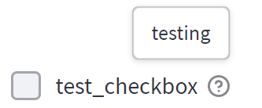

  - 返回值为bool类型

  - 创建时返回值为指定的值，缺省则默认为False

  - 勾选时返回值为True

  - 不勾选时返回值为False

- **label**(str)

  - 显示在按钮上的字

- **value**(bool)

  - 预设该选项的勾选情况

- **key**(str or int)

  - 给一个组件设置的键，如果缺省此项则自动生成一个
  - 多个同类组件会共享同一个键

- **help**(str)

  - 鼠标悬停在上❔时的提示内容

- **on_change**(callable)

  - 点击时触发的函数

- **args**(tuple)

  - 传给on_change的tuple参数

- **kwargs**(dict)

  - 传给on_change的dict参数


#### st.radio

```python
st.radio(label, options, index=0,
         format_func=special_internal_function,
         key=None, help=None,
         on_change=None, args=None,
         kwargs=None
        )
```

- 单选框

  - ```python
    genre = st.radio(label="What's your favorite movie genre",options = ('Comedy', 'Drama', 'Documentary'))
    ```

  - 

  - 返回值为选定的选项内容

- **label**(str)

  - 显示在标题上的字

- **options**(Sequence, numpy.ndarray, pandas.Series, pandas.DataFrame, or pandas.Index)

  - 选项
  - 默认为str类型
  - 不指定时创建时默认选择第一个（最开始的一个）

- **index**(int)

  - 创建时默认选择第几个选项
  - 自0开始

- **format_func**(function)

  - 设置选项的格式
  - 修改选项的标签内容
  - 对该多选框的返回值无影响

- **key**(str or int)

  - 给一个组件设置的键，如果缺省此项则自动生成一个
  - 多个同类组件会共享同一个键

- **help**(str)

  - 鼠标悬停在❔上时的提示内容

- **on_change**(callable)

  - 点击时触发的函数

- **args**(tuple)

  - 传给on_change的tuple参数

- **kwargs**(dict)

  - 传给on_change的dict参数


#### st.selectbox

```python
st.selectbox(label, options,
             index=0,
             format_func=special_internal_function,
             key=None, help=None,
             on_change=None, args=None,
             kwargs=None
            )
```

- 下拉单选

  - ```python
    st.selectbox('slectbox',('Comedy', 'Drama', 'Documentary'))
    ```

  - 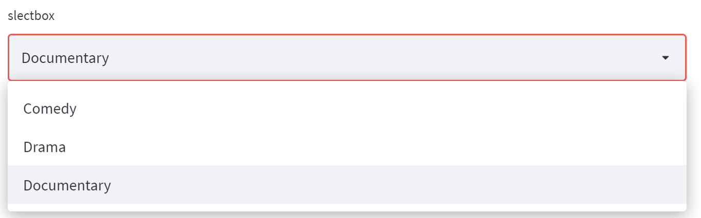

  - 返回值为选定的选项内容

- **label**(str)

  - 显示在标题上的字

- **options**(Sequence, numpy.ndarray, pandas.Series, pandas.DataFrame, or pandas.Index)

  - 选项
  - 默认为str类型
  - 不指定时创建时默认选择第一个（最开始的一个）

- **index**(int)

  - 创建时默认选择第几个选项
  - 自0开始

- **format_func**(function)

  - 设置选项的格式
  - 修改选项的标签内容
  - 对该多选框的返回值无影响

- **key**(str or int)

  - 给一个组件设置的键，如果缺省此项则自动生成一个
  - 多个同类组件会共享同一个键

- **help**(str)

  - 鼠标悬停在上❔时的提示内容

- **on_change**(callable)

  - 点击时触发的函数

- **args**(tuple)

  - 传给on_change的tuple参数

- **kwargs**(dict)

  - 传给on_change的dict参数


#### st.multiselect

```python
st.multiselect(label, options,
               default=None,
               format_func=special_internal_function,
               key=None, help=None,
               on_change=None, args=None,
               kwargs=None
              )
```

- 下拉多选

  - ```python
    st.multiselect('multiselect',('Comedy', 'Drama', 'Documentary'), default=None)
    ```

  - 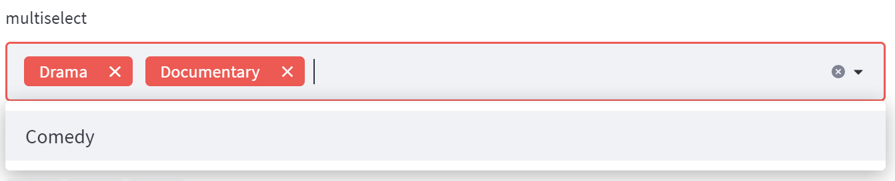

  - 返回值类型为List，内容由选择的项组成

- **label**(str)

  - 显示在标题上的字

- **options**(Sequence, numpy.ndarray, pandas.Series, pandas.DataFrame, or pandas.Index)

  - 选项
  - 默认为str类型
  - 不指定时创建时默认选择第一个（最开始的一个）

- **default** ([str] or None)

  - 创建时默认选择哪几个选项

- **format_func**(function)

  - 设置选项的格式
  - 修改选项的标签内容
  - 对该多选框的返回值无影响

- **key**(str or int)

  - 给一个组件设置的键，如果缺省此项则自动生成一个
  - 多个同类组件会共享同一个键

- **help**(str)

  - 鼠标悬停在上❔时的提示内容

- **on_change**(callable)

  - 点击时触发的函数

- **args**(tuple)

  - 传给on_change的tuple参数

- **kwargs**(dict)

  - 传给on_change的dict参数


#### st.slider

```python
st.slider(label,
          min_value=None, max_value=None,
          value=None, step=None,
          format=None, key=None,
          help=None, on_change=None,
          args=None, kwargs=None
         )
```

- 拉动条

  - ```python
    st.slider(label="slider", min_value=-10, max_value=10, value=0, step=1, help="testing!")
    ```

  - 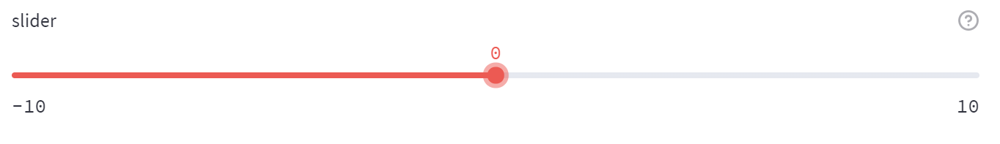

  - 返回值为当前选择的数值

- **label**(str)

  - 显示在标题上的字

- **min_value**(a supported type or None)

  - 最小值

- **max_value**(a supported type or None)

  - 最大值

- **value**(a supported type or a tuple/list of supported types or None)

  - 创建时的默认值
  - 不指定时默认时最小值

- **step**(int/float/timedelta or None)

  - 每次拉动的变化量
  - 对于整型，默认为1
  - 对于浮点型，默认为0.01
  - 对于时间类型，默认为1 timedealt
    - 对日期则是1day
    - 对时刻则是15分钟
    - 或max_value - min_value < 1 day时是整个time

- **format**(str or None)

  - 显示数字的格式
  - 对于整型int或浮点型float支持：%d %e %f %g %i
  - 对时间类型支持[Moment.js标准](https://momentjs.com/docs/#/displaying/format/)

- **key**(str or int)

  - 给一个组件设置的键，如果缺省此项则自动生成一个
  - 多个同类组件会共享同一个键

- **help**(str)

  - 鼠标悬停在上❔时的提示内容

- **on_change**(callable)

  - 点击时触发的函数

- **args**(tuple)

  - 传给on_change的tuple参数

- **kwargs**(dict)

  - 传给on_change的dict参数


#### st.select_slider

```python
st.select_slider(label,
                 options=[], value=None,
                 format_func=special_internal_function,
                 key=None, help=None,
                 on_change=None, args=None,
                 kwargs=None
                )
```

- 选择滑动条

  - ```python
    st.select_slider(label='select_slider', options=[1,'test2',3], value=3, help="testing!")
    ```

  - 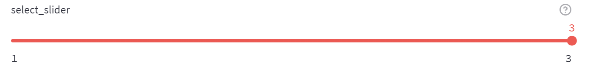

  - 返回值为选择

- **label**(str)

  - 显示在标题上的字

- **options**(Sequence, numpy.ndarray, pandas.Series, pandas.DataFrame, or pandas.Index)

  - 选项
  - 默认为str类型，每项类型可以不同
  - 不指定时创建时默认选择第一个（最开始的一个）

- **value** (a supported type or a tuple/list of supported types or None)

  - 创建时默认选择几个选项

- **format_func**(function)

  - 设置选项的格式
  - 将选中的选项作为参数传入function
  - 输出会被转为str

- **key**(str or int)

  - 给一个组件设置的键，如果缺省此项则自动生成一个
  - 多个同类组件会共享同一个键

- **help**(str)

  - 鼠标悬停在上❔时的提示内容

- **on_change**(callable)

  - 点击时触发的函数

- **args**(tuple)

  - 传给on_change的tuple参数

- **kwargs**(dict)

  - 传给on_change的dict参数


#### st.text_input

```python
st.text_input(label,
              value="", max_chars=None,
              key=None, type="default",
              help=None, autocomplete=None,
              on_change=None, args=None,
              kwargs=None, *, placeholder=None
             )
```

- 文本输入框

  - ```python
    i = st.text_input(label='text_input', max_chars=30, value='test1', help='testing!', placeholder='请输入')
    ```

  - 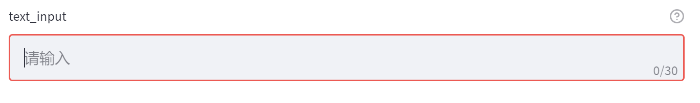

  - 返回值是输入的内容

  - 返回值是在一次完整输入后确认的

- **label**(str)

  - 显示在标题上的字

- **value** (any)

  - 创建时文本框中初始内容
  - 会被转为str类型

- **max_chars**(int or None)

  - 文本框接受的最长长度

- **key**(str or int)

  - 给一个组件设置的键，如果缺省此项则自动生成一个
  - 多个同类组件会共享同一个键

- **type** (str)

  - 文本框的类型
  - ”default“：缺省时的默认值
  - “password”：密码类型

- **help**(str)

  - 鼠标悬停在上❔时的提示内容

- **autocomplete** (str)

  - 自动完成属性
  - 在html效果中为该组件提供自动完成属性
  - 自动完成属性由浏览器识别到标签的该属性后提供
  - 参考[MDN文档](https://developer.mozilla.org/zh-CN/docs/Web/HTML/Attributes/autocomplete)

- **args**(tuple)

  - 传给on_change的tuple参数

- **kwargs**(dict)

  - 传给on_change的dict参数

- **placeholder**(str or None)

  - 未输入内容时在文本框中显示的内容
  - 缺省时文本框无内容时不显示任何东西
  - 未输入内容时返回值是null，而不是该值


#### st.number_input

```python
st.number_input(label,
                min_value=None, max_value=None,
                value=, step=None,
                format=None, key=None,
                help=None, on_change=None,
                args=None, kwargs=None
               )
```

- 数字选择框

  - 返回值是当前显示的值

  - ```python
    st.number_input("number_input", min_value=-10, max_value=10, value=2, step=2, help="testing")
    ```

  - 

- **label**(str)
  - 显示在标题上的字
- **min_value**(int or float or None)
  - 接受的最小值
- **max_value**(int or float or None)
  - 接受的最大值
- **value** (int or float or None)
  - 创建时默认填入的值
  - 缺省则默认填入min_value
- **step** (int or float or None)
  - 单次变化的步长
  - 整型int默认为1
  - 浮点型默认为0.01
  - 其他特定类型由format决定
- **format**(str or None)
  - 设置数值的显示格式
  - 可行的包括：%d %e %f %g %i %u
- **key**(str or int)
  - 给一个组件设置的键，如果缺省此项则自动生成一个
  - 多个同类组件会共享同一个键
- **help**(str)
  - 鼠标悬停在上❔时的提示内容
- **args**(tuple)
  - 传给on_change的tuple参数
- **kwargs**(dict)

  - 传给on_change的dict参数


#### st.text_area

```python
st.text_area(label, 
             value="",
             height=None, max_chars=None,
             key=None, help=None,
             on_change=None, args=None,
             kwargs=None, *, placeholder=None
            )
```

- 文本区域

  - 显示多行文本的组件

  - ```python
    st.text_area("text_area", value="test1",max_chars=60, help="testing!", placeholder="请输入")
    ```

    

  - 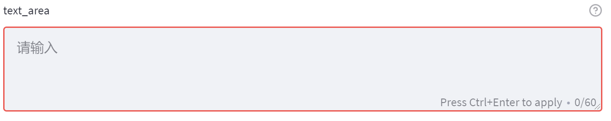

- **label**(str)

  - 显示在标题上的字

- **value** (any)

  - 创建时默认填入的值

- **height**(int or None)

  - 创建出的ui高度

- **max_chars** (int or None)

  - 最大可以接受的字符数

- **key**(str or int)

  - 给一个组件设置的键，如果缺省此项则自动生成一个
  - 多个同类组件会共享同一个键

- **help**(str)

  - 鼠标悬停在上❔时的提示内容

- **on_change**(callable)

  - 点击时触发的函数

- **args**(tuple)
  - 传给on_change的tuple参数
- **kwargs**(dict)

  - 传给on_change的dict参数
- **placeholder**(str or None)
  - 未输入内容时在文本框中显示的内容
  - 缺省时文本框无内容时不显示任何东西
  - 未输入内容时返回值是null，而不是该值

- **placeholder**(str or None)

  - 未输入内容时在文本框中显示的内容

  - 缺省时文本框无内容时不显示任何东西

  - 未输入内容时返回值是null，而不是该值


#### st.date_input

```python
st.date_input(label,
              value=None,
              min_value=None, max_value=None,
              key=None, help=None,
              on_change=None, args=None,
              kwargs=None
             )
```

- 日期选择框

  -  选择或输入一个日期

  - 返回值类型为datetime

  - ```python
    st.date_input(label="date_input")
    ```

  - 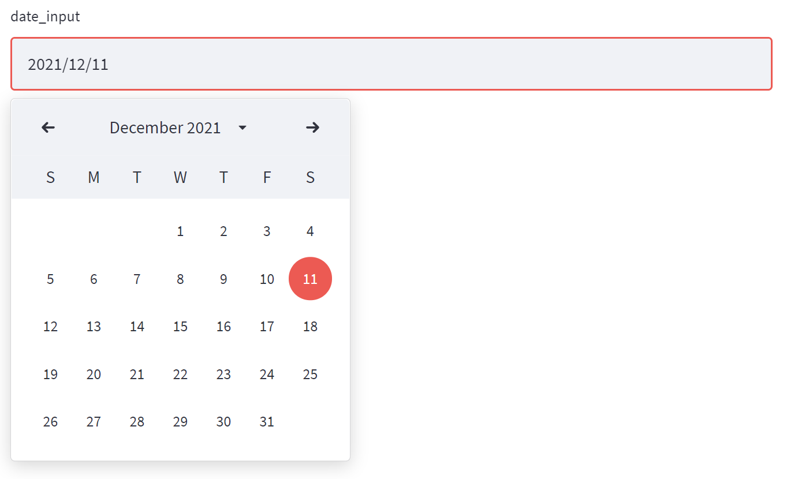

- **label**(str)

  - 显示在标题上的字

- **value**(datetime.date or datetime.datetime or list/tuple of datetime.date or datetime.datetime or None)

  - 组件初始化时显示的值
  - 允许用list或tuple提供一个包含0~2个date或datetime值的范围
  - 缺省时默认为当前时间的单个值
  - 此项为范围时，该组件变为范围选择，返回值类型与此项保持相同

- **min_value**(datetime.date or datetime.datetime)

  - 可选择的最小值
  - 缺省时默认为value往前数10年
  - value为范围时，缺省该项则默认为范围左端点往前数10年

- **max_value**(datetime.date or datetime.datetime)

  - 可选择的最大值
  - 缺省时默认为value往后数10年
  - value为范围时，缺省该项则默认为范围右端点往后数10年

- **key**(str or int)

  - 给一个组件设置的键，如果缺省此项则自动生成一个
  - 多个同类组件会共享同一个键

- **help**(str)

  - 鼠标悬停在上❔时的提示内容

- **on_change**(callable)

  - 点击时触发的函数

- **args**(tuple)

  - 传给on_change的tuple参数

- **kwargs**(dict)

  - 传给on_change的dict参数


#### st.time_input

```python
st.time_input(label,
              value=None, key=None,
              help=None, on_change=None,
              args=None, kwargs=None
             )
```

- 时间选择

  - 选择或输入时间

  - 该组件的时间不是日期，即时刻

  - ```python
    st.time_input("time_input", help="testing!")
    ```

  - 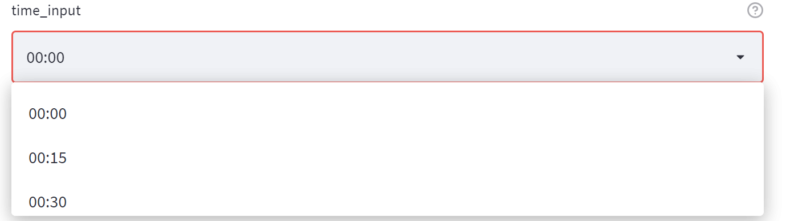

  - 返回值类型是datetime.time或datetime.datetime

- **label**(str)

  - 显示在标题上的字

- **value**(datetime.time/datetime.datetime)

  - 组件创建时的默认值
  - 缺省时默认为当前时间

- **key**(str or int)

  - 给一个组件设置的键，如果缺省此项则自动生成一个
  - 多个同类组件会共享同一个键

- **help**(str)

  - 鼠标悬停在上❔时的提示内容

- **on_change**(callable)

  - 点击时触发的函数

- **args**(tuple)

  - 传给on_change的tuple参数

- **kwargs**(dict)

  - 传给on_change的dict参数


#### st.file_uploader

```python
st.file_uploader(label, type=None,
                 accept_multiple_files=False,
                 key=None, help=None,
                 on_change=None, args=None,
                 kwargs=None
                )
```

- 上传按钮

  - 默认上传文件的大小限制时200MB

  - 更改上传功能的设置查看server.maxUploadSize等选项

  - ```python
    n = st.file_uploader(label='file_uploader', accept_multiple_files=True, help="testing!")
    ```

  - 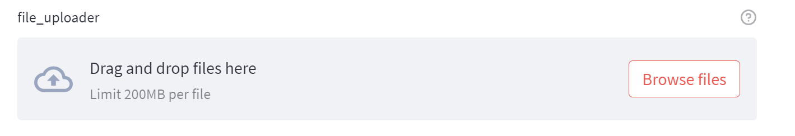

  - 返回值是单个文件file或文件file组成的列表list

- **label**(str)

  - 显示在标题上的字

- **type** (str or list of str or None)

  - 上传允许的文件格式
  - 单个字符串str或字符串str组成的列表list
  - 缺省时默认为所有文件类型

- **accept_multiple_files**(bool)

  - 是否允许同时上传多个文件
  - 默认为Fasle
  - 开启后，此组件的返回值为由文件组成的list

- **key**(str or int)

  - 给一个组件设置的键，如果缺省此项则自动生成一个
  - 多个同类组件会共享同一个键

- **help**(str)

  - 鼠标悬停在上❔时的提示内容

- **on_change**(callable)

  - 点击时触发的函数

- **args**(tuple)

  - 传给on_change的tuple参数

- **kwargs**(dict)

  - 传给on_change的dict参数


#### st.color_picker

```python
st.color_picker(label, value=None,
                key=None, help=None,
                on_change=None, args=None,
                kwargs=None
               )
```

- 拾色器

  -  选择颜色

  - 打开后可以使用16进制码或RGB或HSL输入

  - ```python
    st.color_picker('color_picker', '#00f900')
    ```

  - 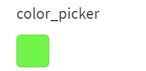

  - 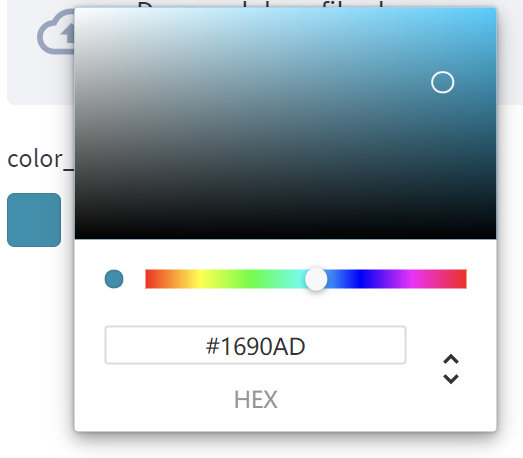

  - 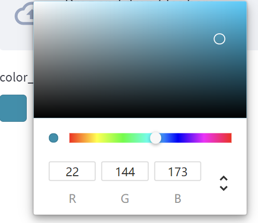

- **label**(str)

  - 显示在标题上的字

- **value**(str)

  - 默认值
  - 十六位
  - 缺省时默认值为黑色black

- **key**(str or int)

  - 给一个组件设置的键，如果缺省此项则自动生成一个
  - 多个同类组件会共享同一个键

- **help**(str)

  - 鼠标悬停在上❔时的提示内容

- **on_change**(callable)

  - 点击时触发的函数

- **args**(tuple)

  - 传给on_change的tuple参数

- **kwargs**(dict)

  - 传给on_change的dict参数

------


### 多媒体组件

#### st.image

```python
st.image(image, 
         caption=None, width=None, 
         use_column_width=None, 
         clamp=False, channels="RGB", 
         output_format="auto"
        )
```

- 图片

  -  

- **image**(numpy.ndarray, [numpy.ndarray], BytesIO, str, or [str])

  - (w,h) 或 (w,h,1)格式的黑白画

  - (w,h,3)的彩色画

  - (w,h,4)格式的RGBA画

  - URL地址

  - SVG XML标签,如：

    ```xml
    <svg xmlns=...</svg>
    ```

  - 由以上格式组成的列表list

- **caption**(str or list of str)

  - 图片的说明
  - 如果是多个图片，则说明按照顺序也是列表list

- **width**(int or None)

  - 图片宽度
  - 默认为图片本身的宽度
  - 不应超过图片本身的宽度
  - 应该为SVG图片手动设置该项，因为它们没有默认宽度

- **use_column_width**('auto' or 'always' or 'never' or bool)

  - 可填入
    - 字符串str
      - auto：设置图片宽度为其本身宽度，但不超过当前列的宽度
      - always：设置图片宽度为当前列宽度
      - never：设置图片宽度为其本身宽度
    - 或布尔bool值
      - True：设置图片宽度为当前列宽度
      - False：设置图片宽度为其本身宽度
  - 该项优先级高于**width**

- **clamp**(bool)

  - 将图片中的颜色的每个通道的值收紧到[0,255]
  - 仅对byte向量的图片起效
  - 对URL引用的图片无效
  - 如果未设置该项，且图片中油超过该范围的值，则会抛出一个错误

- **channels**('RGB' or 'BGR')

  - 对于nd.array类型描述的图片，使用该项来指定颜色通道的顺序
  - 引用其他库的图片格式如OpenCV时，应将该项设置为'BGR'

- **output_format**('JPEG', 'PNG', or 'auto')

  - 设置图片在网页中输出的格式
  - JPEG有压缩丢失
  - PNG没有压缩丢失
  - 默认为auto，由图片源决定


#### st.audio

```python
st.audio(data,
         format="audio/wav",
         start_time=0
        )
```

- 音频
- **data** (str, bytes, BytesIO, numpy.ndarray, or file opened with)
  - 要打开的数据
  - 可以是URL
  - Numpy 向量等数据需要必要的文件头
- **start_time**(int)
  - 播放的起始位置
- **format**(str)
  - 文件的MIME格式
  - 默认为audio/wav
  - 更多信息参考[RFC文档](https://tools.ietf.org/html/rfc4281)


#### st.video

```python
st.video(data, format="video/mp4", start_time=0)
```

-  视频
  -  
- **data**(str, bytes, BytesIO, numpy.ndarray, or file opened with)*
  - 
  - - 要打开的数据
    - 可以是URL
    - Numpy 向量等数据需要必要的文件头
- **format**(str)
  - 文件的MIME格式
  - 默认为video/mp4
  - 更多信息参考[RFC文档](https://tools.ietf.org/html/rfc4281)
    - 这个标准里没有flv
- **start_time**(int)
  - 播放的起始位置


### 布局组件

#### st.sidebar

```python
st.sidebar
```

- 边栏

  边栏是整个应用一直存在的一个唯一组件，直接调用，不能赋值给变量（not callable）

  边栏不支持 `st.spinner` 与 `st.echo` 两个组件

  - 有相同类型的组件时，需要为每个组件设置单独的key，例：

      ```python
      add_selectbox = st.sidebar.selectbox(
          label="How would you like to be contacted?",
          options=("Email", "Home phone", "Mobile phone"),
          key="t1"
      )
      
      add_selectbox2 =  st.sidebar.selectbox(
          label="How would you like to be contacted?",
          options=("Email", "Home phone", "Mobile phone"),
          key="t2"
      )
      ```

- 返回值是对应组件的值


#### st.columns

```python
st.columns(spec)
```

- 列

  -  例：

    ```python
    col1, col2, col3 = st.columns(3)
    
    with col1:
        st.header("A cat")
        st.image("https://static.streamlit.io/examples/cat.jpg")
    
    with col2:
        st.header("A dog")
        st.image("https://static.streamlit.io/examples/dog.jpg")
    
    with col3:
        st.header("An owl")
        st.image("https://static.streamlit.io/examples/owl.jpg")
    ```

  - 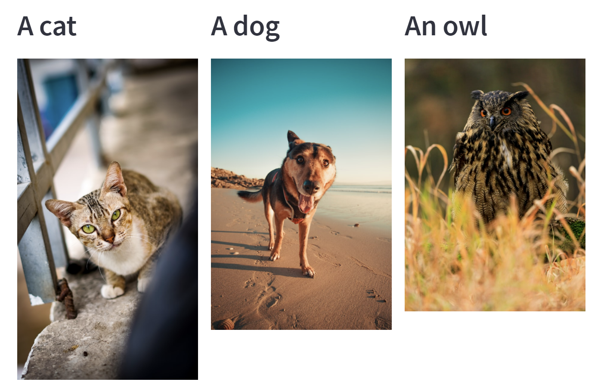

- **spec**(int or list of numbers)

  - 返回参数值个数个列column
  - 将组件放置于列中column


#### st.expander

```python
st.expander(label, expanded=False)
```

- 展开栏

  - 可以展开收起的栏

  - 使用with在展开栏中添加组件内容

  - ```python
    with st.expander(label="expander", expanded=False):
        st.write("tesing")
    ```

  - 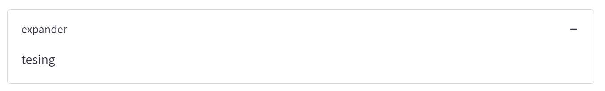

- **label**(str)

  - 在标题栏中显示的内容

- **expanded**(bool)

  - 创建时是否展开


#### st.container

```python
st.container()
```

- 组件容器

  - container中可以添加多个组件

  - 使用with或调用该容器的组件函数来向该容器添加组件内容

  - ```python
    with st.container():
        st.write("container")
    ```

  - 外观上与直接写在页面中效果相同

  - container是逻辑容器，不连续的调用组件仍会在同一container中布置组件，例：

    ```python
    container = st.container()
    container.write("containertext1")
    st.write("not container")
    
    #在container中继续调用组件
    container.write("containertext2")
    ```

    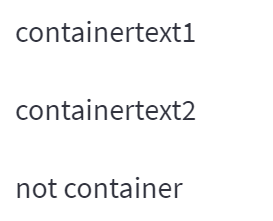


#### st.empty

```python
st.empty()
```

- 单个容器

  - empty中可添加单个组件

  - 使用with或调用该容器的组件函数来向该容器添加组件内容

  - 每次调用组件函数会替换之前添加的组件

  - ```python
    with st.empty():
        st.write("not empty here")
    
    empty = st.empty()
    empty.text("still not empty")
    time.sleep(3)
    empty.text("change")
    ```

- empty组件调用empty函数会清除添加的组件

  ```
  widget.empty()
  ```

------


### 进度与状态

#### st.progress

```python
st.progress(value)
```

-  百分比显示的进度条

  - progress组件调用progress函数来更新该组件的当前状态

  - ```python
    my_bar = st.progress(100)
    
    for percent_complete in range(100).__reversed__():
         time.sleep(0.01)
         my_bar.progress(percent_complete)
    ```

  - 

- **value**(int or float)

  - 设置初始值
  - 整型范围int：[0, 100]
  - 浮点型范围float：[0.0, 1.0]


#### st.spinner

```python
st.spinner(text="In progress...")
```

- 在运行一段代码时暂时放置一段信息

  - ```python
    with st.spinner('Wait for it...'):
        time.sleep(5)
    st.success('Done!')
    ```

    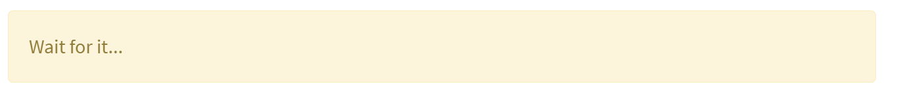

    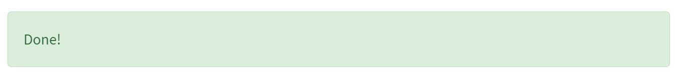

- **text**(str)
  - 设置spinner中的显示的内容


#### st.balloons

```python
st.balloons()
```

- 调用此函数来放出一堆气球进行庆祝

  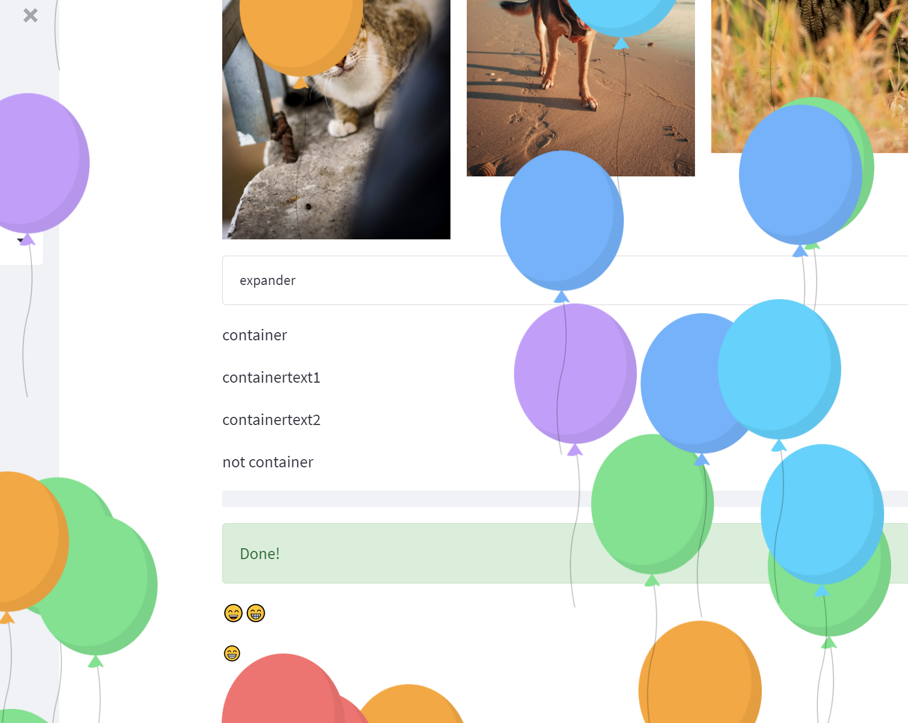


#### st.error

```python
st.error(body)
```

- 放置一个错误信息

  ```python
  st.error('error！💀')
  ```

  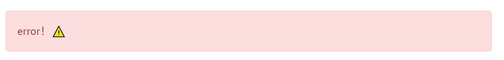


- **body**(str)
  - 设置显示的信息


#### st.warning

```python
st.warning(body)
```

- 放置一个警告信息

  ```python
  st.warning("warning! :warning:")
  ```

  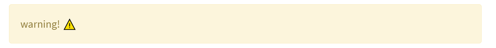

- **body**(str)

  - 设置显示的信息


#### st.info

```python
st.info(body)
```

- 放置一个信息提示

  ```
  st.info('message ℹ')
  ```

  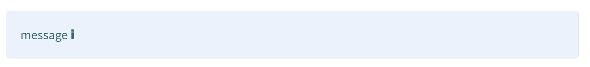

- **body**(str)

  - 设置显示的信息


#### st.success

```python
st.success(body)
```

- 放置一个成功信息

  ```python
  st.success("success 🎉")
  ```

  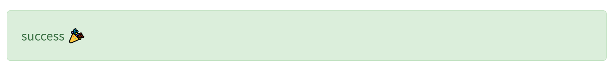

- **body**(str)

  - 设置显示的信息


#### st.exception

```python
st.exception(exception)
```

- 显示一个异常信息

  ```python
  e = RuntimeError(“an exception”)
  st.exception(e)
  ```

  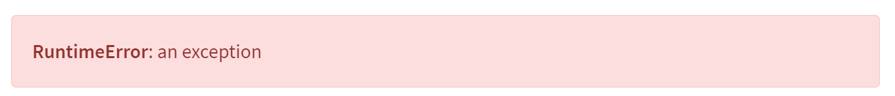

- **exception**(Exception)
  - 要显示相关信息的异常

------


### 流程控制

#### st.stop

```python
st.stop()
```

- 停止流程

  - stop之后的流程将不会被渲染

  ```python
  name = st.text_input('Name')
  if not name:
    st.warning('Please input a name.')
    st.stop()
  st.success('Thank you for inputting a name.')
  ```

  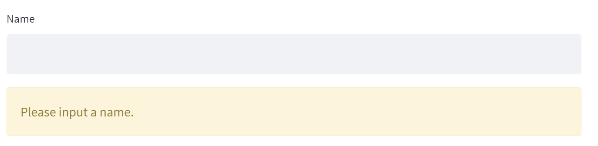

  

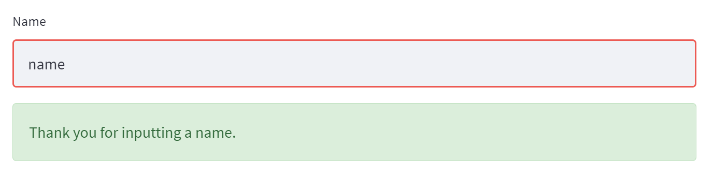


#### st.form

```python
st.form(key, clear_on_submit=False)
```

- 放置一个表单，点击提交按钮将用一个batch提交表单中的内容

  - 如果表单缺失[.form_submit_button()](####st.form_submit_button)函数来放置提交按钮，会抛出一个警告

  - 使用with或者使用form组件的组件函数来向其中添加其他组件，例：

    ```python
    with st.form("my_form"):
        st.write("Inside the form")
        slider_val = st.slider("Form slider")
        checkbox_val = st.checkbox("Form checkbox")
    
        # Every form must have a submit button.
        submitted = st.form_submit_button("Submit")
        if submitted:
            st.write("slider", slider_val, "checkbox", checkbox_val)
    
    st.write("Outside the form")
    ```

    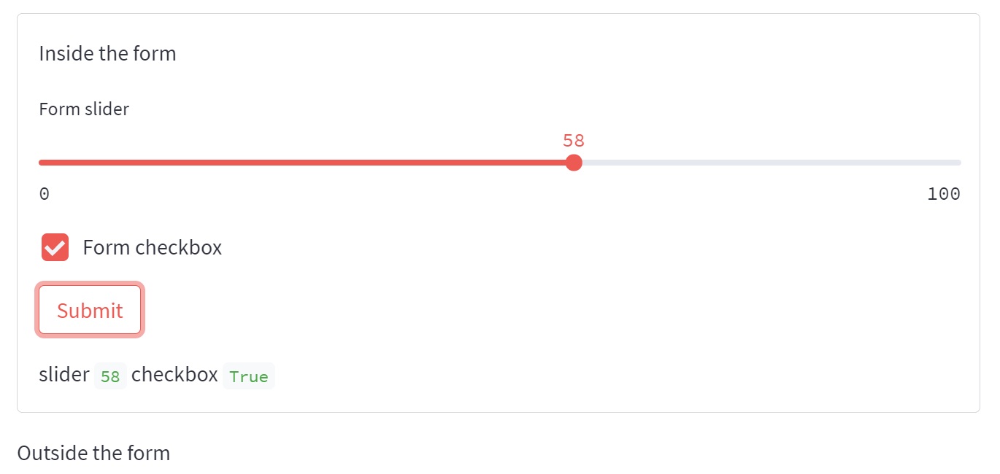

    ```python
    form = st.form(key="my_form2")
    form.slider("Inside the form")
    form.form_submit_button("Submit")
    ```

    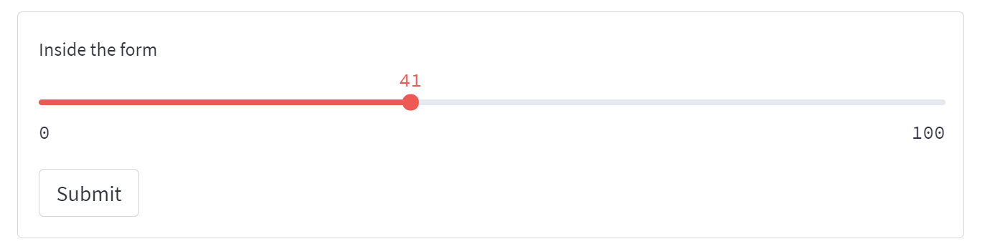

- **key**(!str or int)

  - 给一个组件设置的键，如果缺省此项则自动生成一个
  - 多个同类组件会共享同一个键

- **clear_on_submit**(bool)

  - 如果该项设置为True，则表单中的组件值会在提交后恢复为初始值
  - 默认该项为False


#### st.form_submit_button

```python
st.form_submit_button(label="Submit", 
                      help=None, 
                      on_click=None, 
                      args=None, 
                      kwargs=None
                     )
```

- 表单的提交按钮
- **label**(str)
  - 显示在按钮上的字
  - 默认为"Submit"
- **help**(str or None)
  - 鼠标悬停在上❔时的提示内容
- **on_click**(callable)
  - 点击时触发的函数
- **args**(tuple)
  - 传给on_change的tuple参数
- **kwargs**(dict)

  - 传给on_change的dict参数

------


### 页面设置与代码示例

#### st.set_page_config

```python
st.set_page_config(page_title=None, 
                   page_icon=None,
                   layout="centered", 
                   initial_sidebar_state="auto", 
                   menu_items=None
                  )
```

- 进行页面设置
  -  **必须是第一个调用的streamlit指令，且只能调用一次**
  - 第一个指令意味着magic效果也不能在最前
  - 非Streamlit的部分可以出现在前面
- **page_title**(str or None)
  - 设置页面标题，会在浏览器标签栏显示
  - 如果空缺，则标题显示为"{filename} • Streamlit"
- **page_icon**(Anything supported by st.image or str or None)
  - 设置页面的icon
  - 支持所有st.image支持的图片格式
  - 或使用字符串str
  - 空缺时会使用Streamlit的icon
  - 可以使用emoji来设置
  - 使用"random"会随机选择一个emoji作为icon
- **layout** ("centered" or "wide")
  - 布局对齐效果
  - 默认为"centered"
  - "centered"：在当前column中居中
  - "wide"：相对整个屏幕拉伸
- **initial_sidebar_state**("auto" or "expanded" or "collapsed")
  - 边栏的初始效果
  - 默认为"auto"
  - "auto"：在移动设备上收起边栏，在其他设备上展开
  - "expanded"：展开
  - "collapsed"：收起
- **menu_items**(dict)
  - 在一个字典dict中设置页面右上角的菜单内容
  - "Get help"：一个URL链接，如果为空，则隐藏不显示在菜单中
  - "Report a Bug"：一个URL链接，如果为空，则隐藏不显示在菜单中
  - "About"：一段Markdown来展现相关信息，如果为空，则显示Streamlit的默认About内容
- **问题**：
  - 这部分设置功能可以写在另一个文件中，在主文件中被引入，且仍然保证其是第一个被调用的Streamlit指令
  - 但最好将该部分设置写在主文件中
  - 该设置如果出现在另一个文件中，在主文件被启动时只会在第一次引入该部分的设置
  - 在上述情况中，手动刷新页面、页面本身的动态刷新都会使当前应用丢失这部分设置信息


#### st.echo

```python
st.echo(code_location="above")
```

- 显示一些代码并运行后显示他们的效果
  - 当然是python代码，相当于将当前py文件中的部分代码行显示在页面中
- **code_location**("above" or "below")
  - 代码显示的位置
  - "above"：在结果上方
  - "below"：在结果下方


#### st.help

```python
st.help(obj)
```

- 显示一段python中的help内容
- **obj**(Object)
  - 需要显示help信息的对象

------


### 变化图表

- 使用[`st.empty()`](####st.empty)容器替换单个组件
- 使用[`st.container`](####st.container) or [`st.columns`](####st.columns)替换多个组件
- [`st.add_rows`](####st.add_rows)


#### st.add_rows

```python
element.add_rows(self, data=None, **kwargs)
```

- 向一个数据图表中添加行数
  - 添加的数据行的列数应与已添加的部分相同

- **data** (pandas.DataFrame, pandas.Styler, pyarrow.Table, numpy.ndarray, Iterable, dict, or None)
  - 要显示的数据

- **\*\*kwargs**(pandas.DataFrame, numpy.ndarray, Iterable, dict, or None)
  - 用于合并的命名数据


------


### st.session_state

- 用st.session_state来管理当前会话中的变量

- 通过组件的key来访问组件，类似dict或用成员变量的形式访问

  ```python
  st.session_state['key'] = 'value'
  
  st.session_state.key = 'value'
  ```

- 配合使用st.write来在页面中显示组件的值

- 修改组件的值

  ```python
  st.session_state.key = 'value2'
  st.session_state['key'] = 'value2'
  ```

- 使用不存在的key访问一个组件时，会抛出一个错误

- 在session_state中删除元素

  ```python
  del st.session_state[key]
  ```

  在页面菜单中清除cache也可以删除所有元素


------


### Performance

#### st.cache

```python
st.cache(func=None, persist=False,
         allow_output_mutation=False,
         show_spinner=True, suppress_st_warning=False,
         hash_funcs=None, max_entries=None,
         ttl=None
        )
```

- 使用st.cache标注的函数会在运行时检查三个部分

  - 函数名
  - 函数的代码
  - 调用函数时传入的参数

  第一次调用一个被标注的函数时，Streamlit会记录函数在当前参数下运行的结果，存在页面的cache中，之后调用时如果参数相同，则直接返回这个记录的结果，而不会真的在服务器上运行该函数

- **func** (callable)

  - 存储的函数

- **persist**(boolean)

  - 是否将存储放在硬盘上

- **allow_output_mutation**(boolean)

  - 当返回值变化时默认的会抛出一个警告
  - 如果了解变化且不希望抛出这个警告，将该项设置为True

- **show_spinner**(boolean)

  - 是否显示spinner
  - 当确实cache时默认显示

- **suppress_st_warning**(boolean)

  - 是否阻止从cache内部调用Streamlit函数时的警告

- **hash_funcs**(dict or None)

  - 重载cache中的hash表

- **max_entries**(int or None)

  - 设置cache中保存的最大数量
  - 当达到最大数量时，最老的一个cache会被清除
  - 缺省时没有限制
  - 默认为None，即没有限制

- **ttl**(float or None)

  - cache的存活时间，单位为秒
  - 缺省时没有时间限制
  - 默认为None，即没有限制


#### st.experimental_memo

```python
st.experimental_memo(func=None, persist=None,
                     show_spinner=True, suppress_st_warning=False,
                     max_entries=None, ttl=None
                    )
```

- 使用st.cache标注的函数会保存其执行结果
  - 被标注的函数会记录在一个"pickled"表中，应确保被标注的函数时可pickle的
  - 每次调用被标注函数时，会从cache中获得一个该函数的拷贝
- **func** (callable)
  - 存储的函数
- **persist**(boolean)
  - 是否将存储放在硬盘上
- **show_spinner**(boolean)
  - 是否显示spinner
  - 当确实cache时默认显示
- **suppress_st_warning**(boolean)
  - 是否阻止从cache内部调用Streamlit函数时的警告
- **max_entries**(int or None)
  - 设置cache中保存的最大数量
  - 当达到最大数量时，最老的一个cache会被清除
  - 缺省时没有限制
  - 默认为None，即没有限制
- **ttl**(float or None)
  - cache的存活时间，单位为秒
  - 缺省时没有时间限制
  - 默认为None，即没有限制


### st.experimental_singleton

```python
st.experimental_singleton(func=None, 
                          show_spinner=True, 
                          suppress_st_warning=False
                         )
```

- 使用st.experimental_singleton标注来保存单例函数
  - 单例函数在应用中只有一个实例，将被所有用户的线程访问，因此它应该是线程安全的
  - 如果不能确认线程安全，则使用 `st.session_state` 
- **func** (callable)
  - 存储的函数

- **show_spinner**(boolean)

  - 是否显示spinner

  - 当确实cache时默认显示

- **suppress_st_warning**(boolean)
  - 是否阻止从cache内部调用Streamlit函数时的警告

------


### Advanced features

#### 主题设置

在使用命令行指令启动应用时进行设置或在应用所在的路径下的`.streamlit/config.toml`文件中进行设置，如：

```toml
[theme]
primaryColor="#F63366"
backgroundColor="#FFFFFF"
secondaryBackgroundColor="#F0F2F6"
textColor="#262730"
font="sans serif"
```


##### primaryColor

设置页面的主颜色


##### backgroundColor

设置页面的背景颜色


##### secondaryBackgroundColor

设置页面的副颜色


##### textColor

设置页面的文字颜色


##### font

设置页面的字体

可选项为

- `"sans serif"`
- `"serif"`
- `"monospace"`

缺省或设置了非法值时默认为`"sans serif"`

代码块中的字体不受此项设置影响，始终为`"monospace"`


##### base

使用初始提供的主题

可选项为

- `"light"` 
- `"dark"`

默认为`"light"` 

可以在设置后单独设置其他选项


#### 设置

##### 指令：查看所有设置

```
streamlit config show
```

此项会在命令行中显示所有可行的选项，可根据其中内容在设置文件中进行设置

内容如下：

```toml
# last updated 2021-09-21

[global]

# By default, Streamlit checks if the Python watchdog module is available and, if not, prints a warning asking for you to install it. The watchdog module is not required, but highly recommended. It improves Streamlit's ability to detect changes to files in your filesystem.
# If you'd like to turn off this warning, set this to True.
# Default: false
disableWatchdogWarning = false

# If True, will show a warning when you run a Streamlit-enabled script via "python my_script.py".
# Default: true
#此项设置为True时，在用"python my_script.py"运行一个Streamlit-enabled的py文件时会抛出一个警告
showWarningOnDirectExecution = true

# DataFrame serialization.
# Acceptable values:
# - 'legacy': Serialize DataFrames using Streamlit's custom format. Slow but battle-tested.
# - 'arrow': Serialize DataFrames using Apache Arrow. Much faster and versatile.
# Default: 'arrow'
dataFrameSerialization = "arrow"

[logger]

# Level of logging: 'error', 'warning', 'info', or 'debug'.
# Default: 'info'
level = "debug"

# String format for logging messages. If logger.datetimeFormat is set, logger messages will default to `%(asctime)s.%(msecs)03d %(message)s`. See [Python's documentation](https://docs.python.org/2.6/library/logging.html#formatter-objects) for available attributes.
# Default: None
messageFormat = "%(asctime)s %(levelname) -7s %(name)s: %(message)s"

[client]

# Whether to enable st.cache.
# Default: true
caching = true

# If false, makes your Streamlit script not draw to a Streamlit app.
# Default: true
displayEnabled = true

# Controls whether uncaught app exceptions are displayed in the browser. By default, this is set to True and Streamlit displays app exceptions and associated tracebacks in the browser.
# If set to False, an exception will result in a generic message being shown in the browser, and exceptions and tracebacks will be printed to the console only.
# Default: true
showErrorDetails = true

[runner]

# Allows you to type a variable or string by itself in a single line of Python code to write it to the app.
# Default: true
magicEnabled = true

# Install a Python tracer to allow you to stop or pause your script at any point and introspect it. As a side-effect, this slows down your script's execution.
# Default: false
#安装一个tracer，会减慢运行速度
installTracer = false

# Sets the MPLBACKEND environment variable to Agg inside Streamlit to prevent Python crashing.
# Default: true
fixMatplotlib = true

# Run the Python Garbage Collector after each script execution. This can help avoid excess memory use in Streamlit apps, but could introduce delay in rerunning the app script for high-memory-use applications.
# Default: true
postScriptGC = true

[server]

# List of folders that should not be watched for changes. This impacts both "Run on Save" and @st.cache.
# Relative paths will be taken as relative to the current working directory.
# Example: ['/home/user1/env', 'relative/path/to/folder']
# Default: []
folderWatchBlacklist = []

# Change the type of file watcher used by Streamlit, or turn it off completely.
# Allowed values: * "auto" : Streamlit will attempt to use the watchdog module, and falls back to polling if watchdog is not available. * "watchdog" : Force Streamlit to use the watchdog module. * "poll" : Force Streamlit to always use polling. * "none" : Streamlit will not watch files.
# Default: "auto"
fileWatcherType = "auto"

# Symmetric key used to produce signed cookies. If deploying on multiple replicas, this should be set to the same value across all replicas to ensure they all share the same secret.
# Default: randomly generated secret key.
cookieSecret = "f8b7582082c5a4903916139e55a911170246459cdd73190983f806b7fc81623e"

# If false, will attempt to open a browser window on start.
# Default: false unless (1) we are on a Linux box where DISPLAY is unset, or (2) server.liveSave is set.
headless = false

# Automatically rerun script when the file is modified on disk.
# Default: false
runOnSave = false

# The address where the server will listen for client and browser connections. Use this if you want to bind the server to a specific address. If set, the server will only be accessible from this address, and not from any aliases (like localhost).
# Default: (unset)
#设置特定的地址
#address =

# The port where the server will listen for browser connections.
# Default: 8501
#设置应用的监听端口
port = 8501

# The base path for the URL where Streamlit should be served from.
# Default: ""
baseUrlPath = ""

# Enables support for Cross-Origin Request Sharing (CORS) protection, for added security.
# Due to conflicts between CORS and XSRF, if `server.enableXsrfProtection` is on and `server.enableCORS` is off at the same time, we will prioritize `server.enableXsrfProtection`.
# Default: true
enableCORS = true

# Enables support for Cross-Site Request Forgery (XSRF) protection, for added security.
# Due to conflicts between CORS and XSRF, if `server.enableXsrfProtection` is on and `server.enableCORS` is off at the same time, we will prioritize `server.enableXsrfProtection`.
# Default: true
enableXsrfProtection = true

# Max size, in megabytes, for files uploaded with the file_uploader.
# Default: 200
#最大上传文件大小限制，单位MB
maxUploadSize = 200

# Enables support for websocket compression.
# Default: true
enableWebsocketCompression = true

[browser]

# Internet address where users should point their browsers in order to connect to the app. Can be IP address or DNS name and path.
# This is used to: - Set the correct URL for CORS and XSRF protection purposes. - Show the URL on the terminal - Open the browser - Tell the browser where to connect to the server when in liveSave mode.
# Default: 'localhost'
serverAddress = "localhost"

# Whether to send usage statistics to Streamlit.
# Default: true
#向Streamlit发送统计信息
gatherUsageStats = true

# Port where users should point their browsers in order to connect to the app.
# This is used to: - Set the correct URL for CORS and XSRF protection purposes. - Show the URL on the terminal - Open the browser - Tell the browser where to connect to the server when in liveSave mode.
# Default: whatever value is set in server.port.
serverPort = 8501

[mapbox]

# Configure Streamlit to use a custom Mapbox token for elements like st.pydeck_chart and st.map. To get a token for yourself, create an account at https://mapbox.com. It's free (for moderate usage levels)!
# Default: ""
token = ""

[deprecation]

# Set to false to disable the deprecation warning for the file uploader encoding.
# Default: "True"
showfileUploaderEncoding = "True"

# Set to false to disable the deprecation warning for the image format parameter.
# Default: "True"
#
# DEPRECATED.
# The format parameter for st.image has been removed.
# This option will be removed on or after 2021-03-24.
#
showImageFormat = "True"

# Set to false to disable the deprecation warning for using the global pyplot instance.
# Default: "True"
showPyplotGlobalUse = "True"

[s3]

# Name of the AWS S3 bucket to save apps.
# Default: (unset)
#bucket =

# URL root for external view of Streamlit apps.
# Default: (unset)
#url =

# Access key to write to the S3 bucket.
# Leave unset if you want to use an AWS profile.
# Default: (unset)
#accessKeyId =

# Secret access key to write to the S3 bucket.
# Leave unset if you want to use an AWS profile.
# Default: (unset)
#secretAccessKey =

# The "subdirectory" within the S3 bucket where to save apps.
# S3 calls paths "keys" which is why the keyPrefix is like a subdirectory. Use "" to mean the root directory.
# Default: ""
keyPrefix = ""

# AWS region where the bucket is located, e.g. "us-west-2".
# Default: (unset)
#region =

# AWS credentials profile to use.
# Leave unset to use your default profile.
# Default: (unset)
#profile =

[theme]

# The preset Streamlit theme that your custom theme inherits from. One of "light" or "dark".
#base =

# Primary accent color for interactive elements.
#primaryColor =

# Background color for the main content area.
#backgroundColor =

# Background color used for the sidebar and most interactive widgets.
#secondaryBackgroundColor =

# Color used for almost all text.
#textColor =

# Font family for all text in the app, except code blocks. One of "sans serif", "serif", or "monospace".
# Default: "sans serif"
font = "sans serif"
```

------


### Components API

```python
import streamlit.components.v1 as components
```


#### st.components.v1.html

```python
st.components.v1.html(html,
                      width=None, height=None,
                      scrolling=False
                     )
```

- 在页面中显示一段html内容
  - 效果比使用st.markdown的unsafe_allow_html设置要好
  - 实现效果是将给定的内容在页面的一个iframe标签中显示
- **html**(str)
  - 要显示的html内容
- **width**(int)
  - 展示内容的宽度
  - 单位是CSS的像素大小
  - 缺省时默认为内容本身的宽度
- **height**(int)
  - 展示内容的高度
  - 单位是CSS的像素大小
  - 缺省时默认为150
- **scrolling**(bool)
  - 设置为True时，当内容本身的大小比设置的高度宽度更大时提供滚动条
  - 缺省时默认为False


#### st.components.v1.iframe

```python
st.components.v1.iframe(src, width=None, height=None, scrolling=False)
```

- 在页面中显示一个iframe标签内容
- **src**(str)
  - 要显示的iframe的脚本内容
- **width**(int)
  - 展示内容的宽度
  - 单位是CSS的像素大小
  - 缺省时默认为内容本身的宽度
- **height**(int)
  - 展示内容的高度
  - 单位是CSS的像素大小
  - 缺省时默认为150
- **scrolling**(bool)
  - 设置为True时，当内容本身的大小比设置的高度宽度更大时提供滚动条
  - 缺省时默认为False


### bi-directional component

[该部分需要前端知识，待施工](https://docs.streamlit.io/library/components/components-api#create-a-bi-directional-component)

Streamlit component提供一种编写双向webapp的方式，页面内容会最终写在一个st.components.v1.iframe以html的iframe标签的形式被渲染

以此，可以基本摆脱Streamlit本身提供的页面样式，而只是用其提供的webapp的服务搭建来创建webapp


#### 组成

双向的webapp由两个部分组成

- **前端frontend**
  - 提供前端样式
  - 可以使用任何你喜欢的前端框架
    - JavaScript
    - React
    - Vue
    - etc.
- **Python API**
  - 提供程序逻辑
  - 与前端开启会话实现应用逻辑

------


### Streamlit Cloud

[待施工](https://docs.streamlit.io/streamlit-cloud)

Streamlit项目可以通过Streamlit Cloud托管在github上并且实现一个可对外访问的webapp

------


### 数据库

[待施工](https://docs.streamlit.io/knowledge-base/tutorials/databases)

Streamlit提供对以下数据库的便捷连接方式，当然也可以在python部分导入相关数据库的包

- [AWS S3](https://docs.streamlit.io/knowledge-base/tutorials/databases/aws-s3)
- [BigQuery](https://docs.streamlit.io/knowledge-base/tutorials/databases/bigquery)
- [Snowflake](https://docs.streamlit.io/knowledge-base/tutorials/databases/snowflake)
- [Firestore (blog)](https://blog.streamlit.io/streamlit-firestore/)
- [MongoDB](https://docs.streamlit.io/knowledge-base/tutorials/databases/mongodb)
- [MySQL](https://docs.streamlit.io/knowledge-base/tutorials/databases/mysql)
- [PostgreSQL](https://docs.streamlit.io/knowledge-base/tutorials/databases/postgresql)
- [Tableau](https://docs.streamlit.io/knowledge-base/tutorials/databases/tableau)
- [Private Google Sheet](https://docs.streamlit.io/knowledge-base/tutorials/databases/private-gsheet)
- [Public Google Sheet](https://docs.streamlit.io/knowledge-base/tutorials/databases/public-gsheet)
- [TigerGraph](https://docs.streamlit.io/knowledge-base/tutorials/databases/tigergraph)


## 使用说明

### 更好的控制流程

Streamlit完全基于`.py`文件的顺序来实现页面效果，这意味着整个应用程序的运行逻辑也是按照脚本顺序的，已经计算过的表达式不会再次被计算，即变量值不会在页面中动态地变化，除非页面中的某个组件被点击，进而整个页面会被重新运行一次。

部分组件需要在`with`语句中执行，这意味着有一些局部变量不能在页面的其他部分被访问，可以考虑将这部分变量保存在文件中，在需要被访问时直接访问文件来获取它的值。

